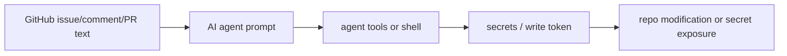

# Agentic Workflow Guard

[](https://github.com/Mughal-Baig/agentic-workflow-guard/actions/workflows/test.yml)
[](https://github.com/Mughal-Baig/agentic-workflow-guard/actions/workflows/code-scanning.yml)
[](https://github.com/Mughal-Baig/agentic-workflow-guard/releases)
[](https://www.npmjs.com/package/awguard)
[](docs/awguard-badge.json)
[](LICENSE)

`agentic-workflow-guard` is a small, zero-dependency scanner for GitHub Actions workflows, persistent agent instruction files, and MCP configs used by AI coding agents, LLMs, or automated review bots.

It looks for a new class of CI/CD risk: untrusted issue, pull request, comment, or branch text flowing into an AI agent prompt, then into write-capable tools, secrets, shell scripts, persistent instructions that weaken review boundaries, or MCP servers that expand agent authority.

Its unique output is an **Agentic Workflow Injection attack graph**:



## Why This Project Can Reach People

Developers want AI speed, but they also want a safety net. Stack Overflow's 2025 Developer Survey found that agent users report productivity gains, while 81% of respondents still worry about security and data privacy for AI agents. GitHub's Octoverse 2025 says AI is now standard in development, with more than 1.1 million public repositories using an LLM SDK and 80% of new developers using Copilot in their first week.

The missing piece is a tool that is easy enough for maintainers to add before they fully understand the security problem. This project gives them one command and one GitHub Action.

## Install

For local development:

```bash
npm test
node ./bin/awguard.js .
```

Install from npm:

```bash
npx awguard .
```

## Use In GitHub Actions

After you upload this repository to GitHub, users can add:

```yaml
name: Agentic Workflow Guard

on:
  pull_request:
  workflow_dispatch:

permissions:
  contents: read

jobs:
  scan-agent-workflows:
    runs-on: ubuntu-latest
    steps:
      - uses: actions/checkout@v4
      - uses: Mughal-Baig/agentic-workflow-guard@v0
        with:
          config: awguard.config.json
          preset: strict
          fail-on: high
```

To adopt the scanner without breaking CI on old findings, commit a baseline file and use:

```yaml
      - uses: Mughal-Baig/agentic-workflow-guard@v0
        with:
          baseline: awguard.baseline.json
          fail-on: high
```

## Use With GitHub Code Scanning

Generate SARIF and upload it with GitHub's official CodeQL SARIF upload action:

```yaml
name: Agentic Workflow Guard Code Scanning

on:
  push:
  schedule:
    - cron: '22 5 * * 1'
  workflow_dispatch:

permissions:
  contents: read
  security-events: write

jobs:
  scan:
    runs-on: ubuntu-latest
    steps:
      - uses: actions/checkout@v4
      - uses: Mughal-Baig/agentic-workflow-guard@v0
        with:
          format: sarif
          output: awguard.sarif
          fail-on: none
      - uses: github/codeql-action/upload-sarif@v4
        with:
          sarif_file: awguard.sarif
          category: agentic-workflow-guard
```

## CLI

```bash
awguard [path] [--config file] [--preset name] [--format text|json|markdown|github|sarif|graph|html|migration|score|badge|inventory] [--output file] [--baseline file] [--write-baseline file] [--fix-dry-run] [--fail-on none|low|medium|high|critical]
```

Examples:

```bash
node ./bin/awguard.js examples/unsafe-agent.yml
node ./bin/awguard.js . --config awguard.config.json
node ./bin/awguard.js . --preset strict --format graph
node ./bin/awguard.js . --format html --output awguard-report.html
node ./bin/awguard.js . --format migration --output awguard-migration.md
node ./bin/awguard.js . --format inventory
node ./bin/awguard.js . --format score
node ./bin/awguard.js . --format badge --output awguard-badge.json
node ./bin/awguard.js . --fix-dry-run
node ./bin/awguard.js . --format markdown --fail-on medium
node ./bin/awguard.js . --format sarif --output awguard.sarif --fail-on none
node ./bin/awguard.js . --write-baseline awguard.baseline.json
node ./bin/awguard.js . --baseline awguard.baseline.json --fail-on high
node ./bin/awguard.js . --format github --fail-on high
```

## Baseline Mode

Baseline mode lets a project start using the scanner without failing CI for already-known issues.

Create a baseline:

```bash
node ./bin/awguard.js . --write-baseline awguard.baseline.json --fail-on none
```

Then fail only on findings that are not in the baseline:

```bash
node ./bin/awguard.js . --baseline awguard.baseline.json --fail-on high
```

The baseline stores stable finding fingerprints, not secrets or workflow contents.

## Configuration

Agentic Workflow Guard automatically loads `awguard.config.json` or `.awguard.json` from the scan root. You can also pass `--config`.

```json
{
  "rules": {
    "AWG010": "off",
    "AWG008": "low",
    "AWG004": {
      "severity": "critical"
    }
  },
  "suppressions": {
    "allowedRules": ["AWG001", "AWG002"],
    "minimumReasonLength": 20
  }
}
```

Rule values can be `"off"`, `"low"`, `"medium"`, `"high"`, or `"critical"`.
See `examples/awguard.config.example.json` for a complete template.

Built-in presets:

- `strict`
- `claude-code`
- `codex`
- `aider`
- `triage-bot`

Use them with `--preset strict` or in config with `"extends": ["strict"]`.

## Attack Graph And HTML Reports

Generate a Mermaid attack graph:

```bash
node ./bin/awguard.js examples/unsafe-agent.yml --format graph
```

Generate a standalone HTML report:

```bash
node ./bin/awguard.js examples/unsafe-agent.yml --format html --output awguard-report.html
```

The report maps source, prompt boundary, capability, authority, and impact for each finding.

## Safe-Output Migration Plans

Generate a migration checklist for converting unsafe agent workflows into read-only agent jobs plus validated safe outputs or approved apply jobs:

```bash
node ./bin/awguard.js examples/unsafe-agent.yml --format migration --output awguard-migration.md
```

The migration report groups findings by workflow file, explains the risk shape, suggests allowed GitHub operations, and gives a reference two-stage pattern:

```text
untrusted GitHub event text
  -> read-only agent job
  -> structured proposal artifact
  -> schema and policy validation
  -> safe outputs or approved apply job
```

## AWI Score And Badge

Generate a shareable Agentic Workflow Injection scorecard:

```bash
node ./bin/awguard.js . --format score
```

Generate a Shields.io endpoint badge JSON:

```bash
node ./bin/awguard.js . --format badge --output docs/awguard-badge.json
```

Then add a badge to your README:

```markdown
[](docs/awguard-badge.json)
```

The score starts at 100 and subtracts risk for critical, high, medium, and low findings. This makes AWGuard easy to show in a README without hiding the detailed SARIF, graph, and migration reports.

## Agentic Surface Inventory

Generate a repository map of agent-related surfaces:

```bash
node ./bin/awguard.js . --format inventory
```

The inventory groups scanned files into GitHub Actions workflows, persistent agent context files, and MCP configs. It shows which surfaces exist, which rules fired, and what to review next. This is useful before a team enables new coding agents because it answers: "Where can agents read instructions, get tools, or act in CI?"

## Agent Context Guard

AWGuard also scans persistent agent instruction files:

- `AGENTS.md`
- `CLAUDE.md`
- `CODEX.md`
- `GEMINI.md`
- `.github/copilot-instructions.md`
- `.github/instructions/*.instructions.md`
- `.github/agents/*.md`
- `.github/prompts/*.prompt.md`
- `.github/skills/**/SKILL.md`
- `.cursor/rules/*.{md,mdc,txt}`
- `.cursorrules`, `.windsurfrules`, and `.clinerules`

It flags instruction files that tell agents to bypass approvals, skip permission prompts, obey issue or PR text as commands, or expose secrets.

## MCP Trust Boundary Guard

AWGuard also scans project-scoped MCP config files without starting the configured servers:

- `.mcp.json`
- `mcp.json`
- `.vscode/mcp.json`
- `.cursor/mcp.json`
- `.windsurf/mcp_config.json`
- `.codeium/windsurf/mcp_config.json`
- `cline_mcp_settings.json`
- `.cline/mcp_settings.json`
- `.roo/mcp.json`
- `.kilocode/mcp.json`
- `claude_desktop_config.json`

It flags MCP configs that start mutable packages such as `npx package`, `uvx package@latest`, or unpinned Docker images, and configs that commit tokens, API keys, passwords, or authorization headers.

## Fix Dry Run

Print remediation guidance without editing files:

```bash
node ./bin/awguard.js examples/unsafe-agent.yml --fix-dry-run
```

## Inline Suppressions

Suppressions are for reviewed false positives. They must include a reason after `--`.

```yaml
# awguard-disable-next-line AWG001,AWG002 -- Reviewed: this workflow only runs after maintainer approval.
- run: openai --prompt "${{ github.event.comment.body }}"

permissions: write-all # awguard-disable-line AWG004 -- Reviewed: release job needs tag write access.
```

If you omit rule ids, the suppression applies to all findings on the target line. Suppression comments without a clear reason are reported as `AWG011`.

## What It Detects

| Rule | Severity | What it finds |
| --- | --- | --- |
| AWG001 | High/Critical | Untrusted GitHub event text passed into an AI agent prompt |
| AWG002 | High | Untrusted GitHub context interpolated in a shell script |
| AWG003 | Critical | `pull_request_target` checking out PR head code |
| AWG004 | High | AI-agent workflows with broad write permissions |
| AWG005 | High | Secrets exposed to untrusted agent workflows |
| AWG006 | High | Agent flags such as `--dangerously-skip-permissions` or `--yolo` |
| AWG007 | High | Model/agent output names flowing into command execution |
| AWG008 | Medium | Agent workflow missing explicit `permissions` |
| AWG009 | Medium | `workflow_run` consuming artifacts before scripts |
| AWG010 | Low | Third-party actions in agent workflows not pinned to a SHA |
| AWG011 | Medium | Invalid suppression comments |
| AWG012 | High/Critical | Agent instruction files that weaken approval, permission, or secret boundaries |
| AWG013 | High | MCP configs that start mutable packages, unpinned containers, or shell wrappers |
| AWG014 | Critical | MCP configs that hardcode secrets, tokens, passwords, or auth headers |

## Example Finding

```text
[CRITICAL] AWG001 Untrusted text reaches an AI agent prompt
  .github/workflows/ai-triage.yml:24
  User-controlled GitHub event text appears to be used as prompt/input for an AI agent.
  Fix: Keep issue, PR, comment, and branch text out of privileged agent prompts unless it is reviewed, delimited, and sanitized.
```

## Roadmap

- Safe autofix for low-risk permission changes.
- Safe-output migration patch previews for common triage and review bots.
- Hosted AWI score API for dynamic cross-repository badges.
- Agent instruction file rule packs for Copilot, Claude Code, Codex, Gemini, Cursor, and Windsurf.
- MCP config rule packs for Claude Code, Copilot, VS Code, Cursor, Windsurf, Cline, and Roo.
- Policy mode for approved MCP packages, actions, token scopes, and agent context files.
- Agent capability SBOM for prompts, tools, MCP servers, permissions, and write paths.
- Trend reports that show newly added agent surfaces and newly introduced findings.
- GitHub App integration for always-on repository monitoring.
- Rule packs for Claude Code, Codex, Gemini, Copilot, Aider, and custom agents.
- Public vulnerable workflow lab with attack and fix walkthroughs.

## Contributing And Security

Contributions are welcome. Start with [CONTRIBUTING.md](CONTRIBUTING.md), and report sensitive security issues using [SECURITY.md](SECURITY.md).

## Research Backing

See [docs/market-analysis.md](docs/market-analysis.md) for the demand analysis, gap, audience, and launch plan.
See [docs/roadmap.md](docs/roadmap.md) for the scope expansion roadmap.
