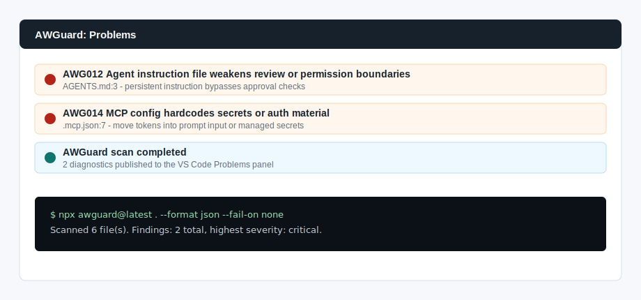

# AWGuard VS Code Extension POC

This is a lightweight proof of concept for running AWGuard from the VS Code command palette and showing findings in the Problems panel.

It is intentionally small:

- No bundled dependencies.
- Uses `npx awguard@latest` by default.
- Runs `--format json --fail-on none`.
- Converts AWGuard findings into VS Code diagnostics.
- Includes a contributed problem matcher named `$awguard`.

## Local Development

Open this folder in VS Code and run:

```bash
npm install
```

Then press `F5` to launch an Extension Development Host.

Run the command:

```text
AWGuard: Scan Workspace
```



## Terminal Capture

The task and extension both surface the same finding shape:

```text
[HIGH] AWG012 Agent instruction file weakens review or permission boundaries
  AGENTS.md:3
  A persistent agent instruction appears to weaken approval or permission boundaries.
```

## Packaging Notes

This folder is a proof of concept, not a Marketplace-ready extension. Before publishing:

- Add extension icon and screenshots.
- Add configuration for a local `awguard` binary path.
- Add workspace trust handling.
- Add a test workspace with golden diagnostics.
- Package with `vsce package`.
